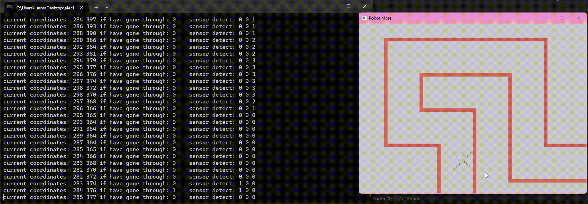

# USYD ELEC 1601 ROBOT MAZE SIMULATION

team memebr:

* Shaopeng Luan(Program Develop)
* Liosa Long(Robot Algorithm)
* Zixin Zhou(PPT)
* Sean Kim(Video)

## Developing Cooperation

We use git to do teamwork. Git is a common used cross-platform distributed version control system and the code is hosted in github.

## Program Construction (contributor: Shaopeng Luan)

For cross-platform and teamwork, we use CMake to contrusct our program thus can run or debugging in any OS high-efficiency.

CMake has a bunch of nice features, such as good supporting for all the C and C++ complier and good integrate with VScode.

## Improvement in time record (contributor: Shaopeng Luan)

the time record porvided by the original code template is not precise enough, I declared the variable and call `time()` from `time.h` to get linux time stamp for right time display.

## Improvement in terminal output (contributor: Shaopeng Luan)

I have improved the terminal output for better information release, it deepends on path track function which can allow us real-time analysis of the robot.


## New Feature: Curve Wall (contributor: Shaopeng Luan)

the original function to build walls can only be the form of rectangle. I have adopted the Bezier Curve that is avaliable to build any shape of the wall.

```c
int create_wall(struct Wall_collection **head, int current_wall_keys,
                int start_point[2], int end_point[2], int critical_point[2],
                int thick, double precision);
```

* it accept three basic parameters: start point and end point in pixel, thick.
* critical point is used to build curve, when you specify this variable outside the line of formed by the starting and eneding, it will make this curve as close as to the stationary point for the ideal curve.
* precision, the precision of this curve should be specifyed between 0.001 to 0.01 for reasonable shape, it should be noted that the higher precision you specifed, the more effieciency consumption you need.

## New Feature: Dynamic Wall (contributor: Shaopeng Luan)

```c
void update_dynamic_wall(SDL_Renderer *renderer, struct Wall_collection *head,
                         int speed)
```


* for building this wall, you need to create a collection of walls in the form of a linked chart provided by the template.
* the `speed` parameter is lower, the actual speed is faster.
* It cannot draw multiple walls at the same time that need to innovate.

## New Feature: path track (contributor: Shaopeng Luan)


I wrote the path tracking function to observe the path of the robot to better optimize the algorithm.

here is the implement:

### linked list

Linked lists are commonly used data structures for dynamically expandable arrays which allowss us to record the path in a maze large enough.

```c
typedef struct PathTrackNode {
    CurrentCoordinate coord;
    struct PathTrackNode* next;
} PathTrackNode;
```

### hash

The hash function can be used to travese the current linked list faster. I use hash to replace the index of arrays not only for tracking paths, but also for faster analiysis for known paths.

 ```c
 int hash(PathHashTable* table, int x, int y) {
  unsigned int h = 0;
  h = 31 * h + x;
  h = 31 * h + y;
  return h % table->size;
}
 ```

### Reserved design: existsCoordinate()

Even though it has been abandoned in the actual alogrithim, I think it still has value. Just beacause I am using hash alorigthm, analyzing it will become easy.

Notice the path in red color and terminal output "if have gone through: "



If the robot has gone through the same coordinates, the function will return 1 and paths will be empty.

```c
int COORDINATE_OFFSET = 10;
int OVERLAP_COUNT = 1;
int existsCoordinate(PathHashTable* table, int x, int y);
```

It will accept two global variables. COORDIANTE_OFFSET can provide fuzzy matching means when the robot walks a `COORDINATE OFFSET` pixel around the path, it returns 1. `OVERLAP_COUNT` provides when the robot encounters an OVERLAP COUNT of pixels, it returns 1.

## Robot Algorithm (contributor: Liosa Long)

### step 1


### step 2

case 1


case 2


corner sensor

